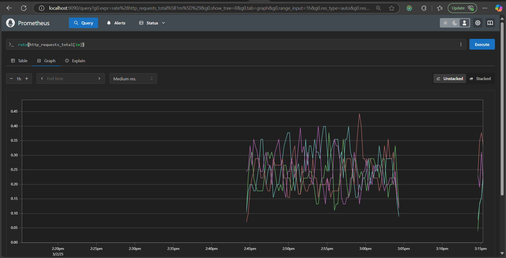

# Prometheus Demo

This repository contains a demo of prometheus, an open-source monitoring tool.

## 🔖 Concepts

### ⏲️ Counter

The Counter instrumenting tool is used for monitoring metrics that only _go up_ and usually reset when the process restarts. Such instances could be checking the number of requests made to a service or the number of exceptions occurred.

### 📈 Gauge

The Gauge instrumenting tool is used for monitoring metrics that have indeterminate values which can go up and down at any point in time. It could be used to monotor resource usage or the size of a resource.

### 📊 Histogram

Monitors the count and latency of requests in `intervals/buckets`. A bucket contains aggregated data for a quantile

### 🏷️Labels

With labels, similar metrics that change tags or field names can be grouped for efficient retrieval. The benefit of this is that no new entities are created in the time-series database prometheus uses. For instance, a web application may have a metric such as `http_requests_total` with labels matching `endpoint` and `method`. In this way, all metrics about the total request is stored in one entity and differentiated with labels that help us to effectively query and determine which endpoint was called and what method was used.

```bash
# start the metrics server here
python metrics.py
```

```bash
# poll the metrics server to monitor updates
curl http://localhost:8000
```

```bash
# start the prometheus server
docker compose up
```


